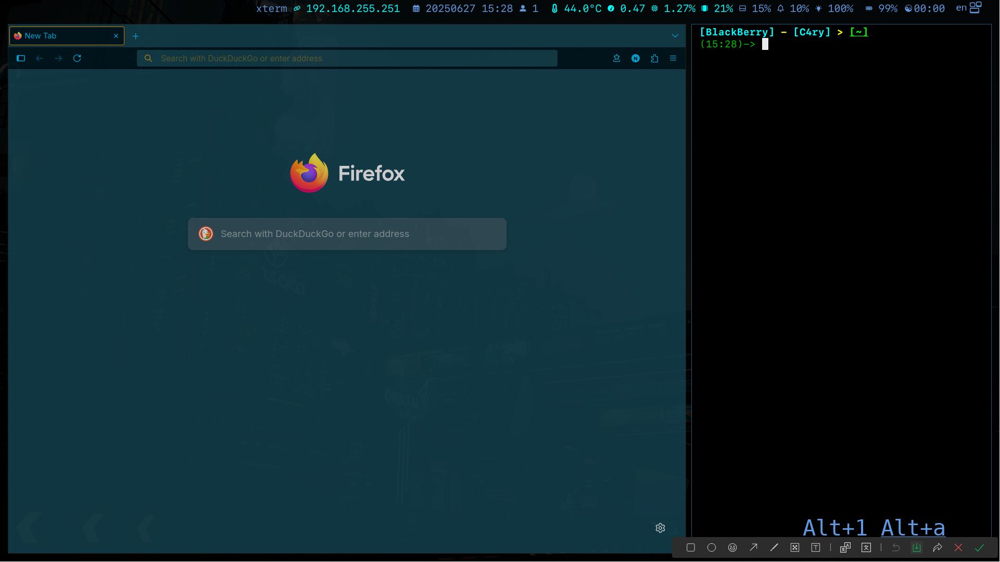

# 
 For i3 window manager 

### 
 Installation: [English](./language/English.md) | [中文](./language/Chinese.md) 

## Instructions
- ##### This theme can be built in archlinux
- ##### The operating environment is extremely lightweight

## Build the Environment

  | Standards |  x86_64/ARM | Dependence |
  | :------ | :------ | :------- |
  | Kernel | linux-zen | systemd/lvm |
  | Lander | lxdm | gtk3/breeze-dark |
  | Manager | i3/i3blocks | gtk/gtk2/gtk3/gtk4/qt5ct/qt6ct |
  | Displays | X11 | picom/rofi/xf86-input-amdgpu |
  | Shell |  xterm | bash/zsh/zsh-completions/zsh-syntax-highlighting/zsh-autosuggestions/zsh-history-substring-search |
  | Files | ranger/dolphin | devicons/gtk6ct/breeze-dark |
  | Fonts | Microsoft/SFMonoNerd | others |
  | Text | vim/nano/code | vim-molokai |
  | Input | fcitx5 | simple-dark/libxxf86vm/lib32-libxxf86vm/xf86-input-synaptics/xf86-input-libinput |
  | Sound | alsa-lib | xf86-input-void/pactl |
  | Bluetooth | bluez | bluetoothctl |
  | Light | brightnessctl | xf86-input-evdev |

## See

