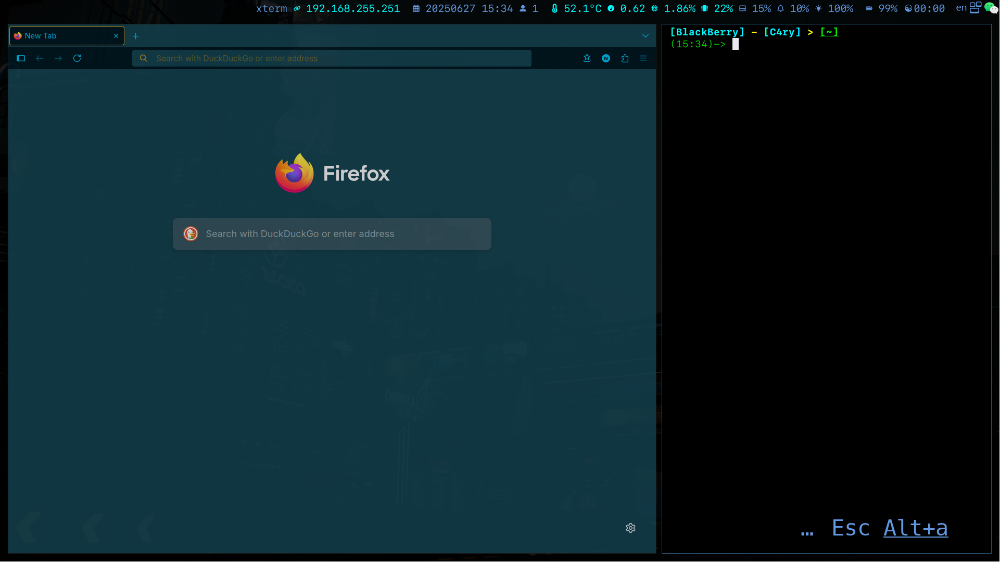

# <p align="center"> For i3 window manager </p>

### <p align="center"> Installation: [English](./language/English.md) | [中文](./language/Chinese.md) </p>

## Instructions
- ##### This theme can be built in archlinux
- ##### The operating environment is extremely lightweight

## Build the Environment

  | Standards | x86_64/ARM           | Dependence                                                                                        |
  | :-------- | :------------------- | :------------------------------------------------------------------------------------------------ |
  | Kernel    | linux-zen            | systemd/lvm                                                                                       |
  | Lander    | lxdm                 | gtk3/breeze-dark                                                                                  |
  | Manager   | i3/i3blocks          | gtk/gtk2/gtk3/gtk4/qt5ct/qt6ct                                                                    |
  | Displays  | X11                  | picom/rofi/xf86-input-amdgpu                                                                      |
  | Shell     | xterm                | bash/zsh/zsh-completions/zsh-syntax-highlighting/zsh-autosuggestions/zsh-history-substring-search |
  | Files     | ranger/dolphin       | devicons/gtk6ct/breeze-dark                                                                       |
  | Fonts     | Microsoft/SFMonoNerd | others                                                                                            |
  | Text      | vim/nano/code        | vim-molokai                                                                                       |
  | Input     | fcitx5               | simple-dark/libxxf86vm/lib32-libxxf86vm/xf86-input-synaptics/xf86-input-libinput                  |
  | Sound     | alsa-lib             | xf86-input-void/pactl                                                                             |
  | Bluetooth | bluez                | bluetoothctl                                                                                      |
  | Light     | brightnessctl        | xf86-input-evdev                                                                                  |

## See



## Support
- ##### Brightness adjustment
- ##### Volume adjustment
- ##### Touchpad
- ##### Battery monitor
- ##### Internet protocol monitor
- ##### load monitor
- ##### Window indicator
- ##### Program Launcher

## Shortcut keys

#### The "Move" keys
``` bash
# h : left
# j : down
# k : up
# l : right
```
##### Example
``` bash
#Alt + Shift + h : move window to left
#Win + Shift + 2 : move window to workspace 2
```

#### The "Alt" Keys
``` bash
# Alt + F1 :open terminal
# Alt + p :open screenkey
# Alt + c :open vscode
# Alt + f :open firefox
# Alt + r :resize window
# Alt + s :open gsettings
# Alt + Shift + r :restart window manager
# Alt + Shift + q :exit window manager
# Alt + mouse_left :move window
# Alt + mouse_right :resize window
```

#### The "WIn/Option" Keys
``` bash
# Win + r : run command
# Win + d : run desktop application
# Win + 1 : to workspace 1
# Win + 2 : to workspace 2
# Win + 3 : to workspace 3
# Win + Shift + 1 : take window to workspace 1
# Win + Shift + 2 : take window to workspace 2
# Win + Shift + 3 : take window to workspace 3
```