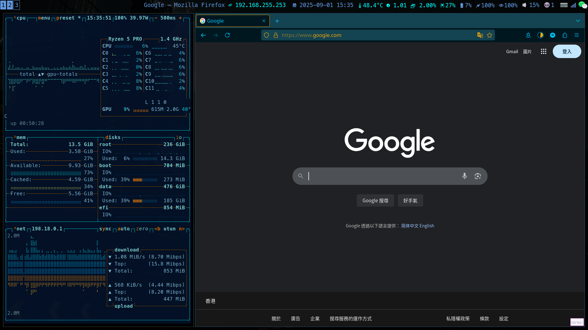

### <p align="right"> Option: [中文](language/Chinese.md) </p>

##### <p align="right"> A simple and efficient desktop environment </p>

## Build the Environment

  | Standards | x86_64           | Dependence                                                                                        |
  | :--- | :--- | :--- |
  | Kernel    | linux 6.12           | systemd                                                                                       |
  | Lander    | lxdm                 | breeze-dark                                                                                  |
  | Manager   | i3              | gtk/qt                                                                    |
  | Displays  | Xorg                  | picom/rofi/polybar                                                                      |
  | Shell     | kitty                | bash/zsh |
  | Files     | dolphin       | xfs/btrfs                                                                       |
  | Fonts     | Microsoft/Meslo | copy                                                                                            |
  | Text      | vim        | vim-molokai                                                                                       |
  | Input     | fcitx5               | simple-dark                  |
  | Sound     | pulseaudio             | xf86audio                                                                             |
  | Bluetooth | bluez                | bluetoothctl                                                                                      |
  | Light     | bright        | libinput                                                                                  |

## See



## Support
- ##### Brightness adjustment
- ##### Volume adjustment
- ##### Touchpad
- ##### Window indicator
- ##### Program Launcher

## Install Archlinux
### Build storage
``` shell
parted /dev/nvme0n1
mklabel gpt
mkpart ESP 4096s 768M
mkpart primary 768M -1
set 1 boot on
# show storage status
lsblk
fdisk -l
```
### Format the storage
``` shell
mkfs.fat -F32 /dev/nvme0n1p1
```
### Create LVM storage and mount
``` shell
pvcreate /dev/nvme0n1p2
vgcreate linux /dev/nvme0n1p2
lvcreate -l +100%FREE linux -n root
# reset format the lvm2 storage
mkfs.btrfs /dev/mapper/linux-root
lvs # show lvm2 storage status
mount /dev/mapper/linux-root /mnt
mkdir -p /mnt/boot
mount /dev/nvme0n1p1 /mnt/boot
df -h # show mounting status
```
## System init
### Install the system
``` shell
# this step need internet
echo 'Server = https://mirrors.ustc.edu.cn/archlinux/$repo/os/$arch' > /etc/pacman.d/mirrorlist
sudo pacman-key --init && sudo pacman-key --populate archlinux
sudo pacman -Syy && sudo pacman -S archlinux-keyring
pacstrap /mnt base base-devel linux-lts linux-lts-headers linux-firmware intel-ucode/amd-ucode # install testing 
bash Install.sh
genfstab -U /mnt > /mnt/etc/fstab # write to fstab
cat /mnt/etc/fstab # show writing status
```
### Init setup
``` shell
arch-chroot /mnt
vim /etc/hostname # device rename
# add Chinese
vim /etc/locale.gen
    en_US.UTF-8 UTF-8
    zh_CN.UTF-8 UTF-8
# flash language 
locale-gen
echo 'LANG=en_US.UTF-8'  > /etc/locale.conf
# fix fonts
echo "KEYMAP=us" > /etc/vconsole.conf
echo "FONT=lat9u-16" >> /etc/vconsole.conf
mkinitcpio -P # create kernel files
```
#### Git clone repository
``` shell
mkdir -p /data/git && cd /data/git
git clone -b lts --single-branch https://github.com/pro1tocol/DarkarchWM.git
mv DarkarchWM DarkarchWM_lts && cd DarkarchWM_lts && pwd
```
#### Update $HOME(root) and update kernel mkinitcpio
``` shell
passwd root # changer the root password
cd dotfiles/ROOT/
sudo cp -rf ./* $HOME
mv $HOME/inputrc $HOME/.inputrc
mv $HOME/nanorc $HOME/.nanorc
mv $HOME/vimrc $HOME/.vimrc
mv $HOME/zshrc $HOME/.zshrc
echo $SHELL # changer default shell environment 
    # /bin/bash
chsh -s /bin/zsh # change to zsh
# update kernel files
vim /etc/mkinitcpio.conf
# ...
	HOOKS=(base systemd udev autodetect microcode modconf kms keyboard keymap consolefont block lvm2 filesystems fsck btrfs)
# ...
mkinitcpio -p linux-lts # run update 
```
#### Systemd-boot show config
``` shell
bootctl status # show boot status
ls -l /boot # show boot some files
cat /etc/fstab # show storage status(record UUID)
```
#### Systemd-boot setup
``` shell
bootctl install
cd /boot
sudo vim loader/loader.conf # change the boot way
	  default DarkarchWM.conf
	  timeout 10
    console-mode max
    editor no
sudo vim loader/entries/DarkarchWM.conf
    title   DarkarchWM
    linux   /vmlinuz-linux-lts
    initrd  /intel-ucode.img
    initrd  /initramfs-linux-lts.img
    options root=/dev/mapper/System-DarkarchWM ro rd.lvm.lv=System/DarkarchWM quiet
bootctl status
bootctl list # verify boot
exit
umount -R /mnt && reboot # restart the system validation takes effect
```
### Update mirrors sources and mirors kering
``` shell
# change archlinux mirrors sources in you country
vim /etc/pacman.conf
    [multilib]
    #Inclu...
    [archlinuxcn]
    Server = https://mirrors.ustc.edu.cn/archlinuxcn/$arch
# update mirrors sources keyring
pacman-key --init && pacman-key --populate archlinux
pacman -Syy && pacman -Syu
pacman -S archlinux-keyring archlinuxcn-keyring && pacman -S yay
```
---
### Create admin user
``` shell
useradd -m -G wheel -s /bin/zsh alarm # create user
passwd alarm
# modify permissions
EDITOR=vim visudo
%wheel ALL=(ALL: ALL) ALL
# adjust path permissions
sudo chown alarm:alarm -R /data
cd /data/git/DarkarchWM_lts/zsh/USER
su alarm
cp inputrc /home/alarm/.inputrc
cp nanorc /home/alarm/.nanorc
cp vimrc /home/alarm/.vimrc
cp xprofile /home/alarm/.xprofile
cp Xresources /home/alarm/.Xresources
cp zshrc /home/alarm/.zshrc
exit
```
### Fix kernel mkinitcpio
``` shell
yay -S fcitx5 fcitx5-configtool fcitx5-gtk fcitx5-rime # install the input method
exit
mkinitcpio -p linux-lts # fix model
```
### Install tool nad graphics device
``` shell
su alarm
# intel
yay -S mesa lib32-mesa vulkan-intel lib32-vulkan-intel # run on the base

# amd
yay -S mesa lib32-mesa xf86-video-amdgpu vulkan-radeon  lib32-vulkan-radeon libva-mesa-driver

# Nvidia-open
yay -S nvidia-open-lts nvidia-settings lib32-nvidia-utils nvidia-utils
# disable kms model (options)
# sudo vim /etc/mkinitcpio.conf

# Nvidia
yay -S nvidia-lts nvidia-settings lib32-nvidia-utils nvidia-utils
```
#### DarkarchWM required component
``` shell
# gnome all black
gsettings set org.gnome.desktop.interface color-scheme 'prefer-dark' && \ 
gsettings get org.gnome.desktop.interface color-scheme
# install fonts
su root
sudo cp -rf usr/share/fonts/Windows-to-Linux-Fonts /usr/share/fonts && \
sudo cp -rf usr/share/fonts/Meslo /usr/share/fonts && \
sudo cp -rf usr/share/fcitx5/themes/DarkarchWM /usr/share/fcitx5/themes && \
sudo cp -rf usr/share/gtk-* /usr/share && \
sudo cp -rf usr/share/qt* /usr/share && \
sudo cp -rf usr/share/lxdm/themes/BlackArch /usr/share/lxdm/themes && \
sudo cp usr/share/rofi/themes/DarkarchWM.rasi /usr/share/rofi/themes && \
sudo cp usr/share/X11/xorg.conf.d/* /usr/share/X11/xorg.conf.d && \
sudo cp etc/environment /etc/environment && \
sudo cp etc/lxdm/lxdm.conf /etc/lxdm && \
sudo cp etc/pam.d/lxdm /etc/pam.d && \
sudo cp etc/profile /etc && \
sudo cp etc/profile.d/offbeep.sh.bak /etc/profile.d && \
sudo cp etc/profile.d/append_path.sh /etc/profile.d && \
sudo cp etc/systemd/logind.conf /etc/systemd && \
mkinitcpio -p linux-lts && reboot
```
#### DarkarchWM is loaded for testing
``` shell
sudo systemctl start lxdm.service
```
#### Install all applications(options)
``` shell
yay -S nmap wireshark-qt wireshark-cli reaver bully cowpatty macchanger hashcat hcxdumptool hcxtools
yay -S pyrit pixiewps wifite john wireshark-cli ruby
yay -S qt6ct-kde
```

## Shortcut keys

#### The "Move" keys
``` bash
# h : left
# j : down
# k : up
# l : right
```
##### Example
``` bash
# Win + Shift + 2 : move window to workspace 2
# Alt + l : move window to right
# Win + f : resize window to bigger
```

#### The "Alt" Keys
``` bash
# Alt + F1 :open terminal
# Alt + q :close window
# Alt + p :open screenkey
# Alt + c :open vscode
# Alt + f :open firefox
# Alt + s :open gsettings
# Alt + Shift + r :restart window manager
# Alt + Shift + q :exit window manager
# Alt + mouse_left :move window
# Alt + mouse_right :resize window
```

#### The "WIn/Option" Keys
``` bash
# Win + r : run command
# Win + d : run desktop application
# Win + q : window to lock
# Win + 1 : to workspace 1
# Win + 2 : to workspace 2
# Win + 3 : to workspace 3
# Win + Shift + 1 : take window to workspace 1
# Win + Shift + 2 : take window to workspace 2
# Win + Shift + 3 : take window to workspace 3
```